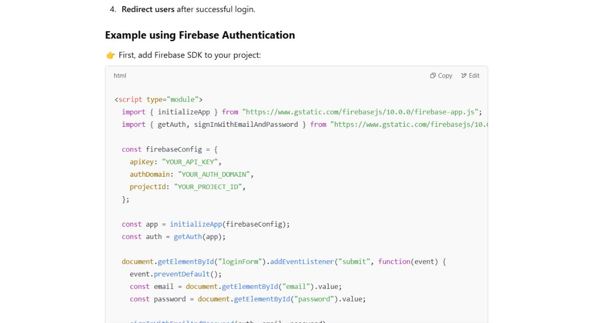
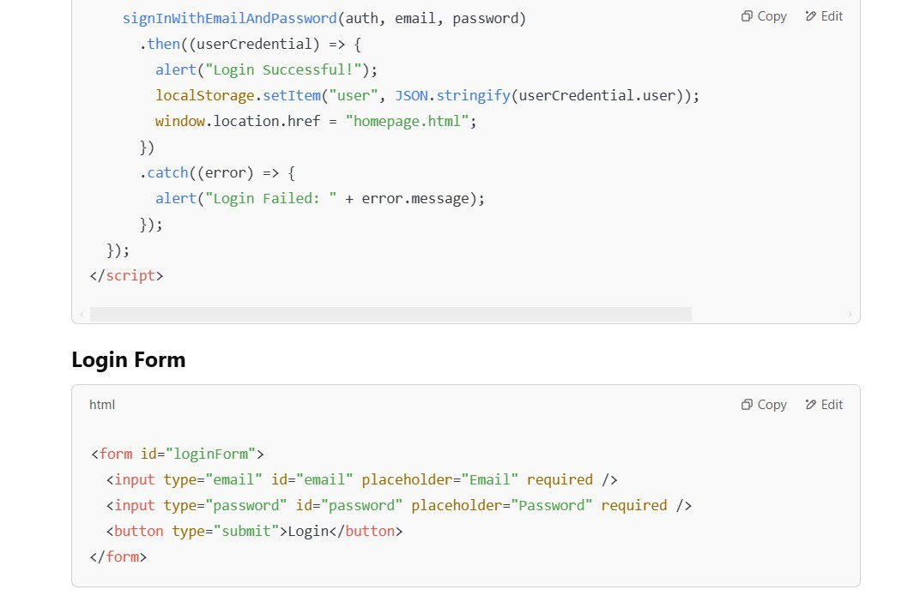

# Noir Soleil 🌿 - Sustainable Perfume E-Commerce  

Noir Soleil is an innovative perfume brand dedicated to sustainability. We offer luxurious, eco-friendly fragrances with a focus on **refillable glass bottles**, upcycling, and reducing waste. Our platform also features a curated selection of other sustainable perfume brands.  

##  Design Process
We wanted to design an aesthetically appealing website that would cater to perfume lovers ranging from young teens to adults and encourage them to explore their own scent and learn how we combine sustainability with luxury. As designers of this wesbite we want to cater to the different player types: Willing to play (Achievers and Socializers) and Non-willing to play (Self-seekers and consumers). We want the best experience for our users 

**Figma links**
High fidelity- https://www.figma.com/proto/lvyzJ32qvx2ihTLvCdonaL/High-Fidelity-IP?node-id=0-1&t=yNpAxiiCXQtrdlG6-1
Low fidelity- https://www.figma.com/proto/ABIuNSjotG5JbXxWAyDbP3/Low-fidelity-IP?node-id=0-1&t=TD3K4OYO0CF2Mp1y-1

**Logo Design**


---

##  Features  
- 🛍 **E-commerce Platform** – Buy perfumes with a seamless online shopping experience by adding items to cart.  
- 🌱 **Sustainability-Focused** – Discounts through our **Essence Empire** refill program.  
- 🔬 **About us** - Find out more about Noir Solei.  
- 🏆 **Multi-Brand Selection** – Showcasing other eco-conscious perfume brands that contribute to sustainability.
- **Profile** - Log in to Noir Solei to enhance user experience

---

## 🛠️ Tech Stack  
- **Frontend:** HTML, CSS, JavaScript (React)  
- **Backend:** Node.js, Express  
- **Database:** Firebase
- API for log in and cart system

## 🖼️ Screenshots
screenshots of AI assistance 




## CREDITS
-Replica Website: https://www.maisonmargiela-fragrances.eu/en_GB/fragrances/by-collection/replica/
-Pintrest: https://www.pinterest.com/ 

---

## 🚀 Installation & Setup  

### **1. Clone the Repository**  
```sh
git clone https://github.com/yourusername/noir-soleil.git
cd noir-soleil
